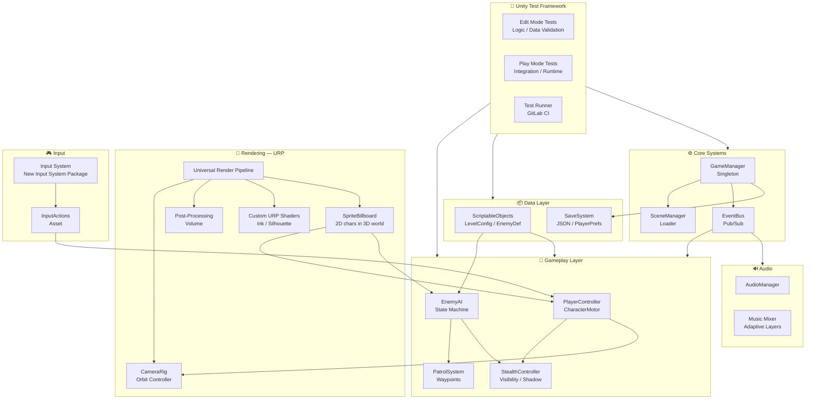

# Ink-Shinobi — Technical Documentation
**Version:** 1.0 · **Engine:** Unity (URP) · **Genre:** 2.5D Stealth

---

## 1. Project Overview

**Ink-Shinobi** is a 2.5D stealth game set in feudal Japan during the Sengoku/Shogunate era. The player controls a ninja navigating fully three-dimensional environments, while the camera rotates dynamically through 3D space to always maintain a fixed side-on perspective — preserving the feel and readability of a classic 2D platformer within a living, volumetric world. Characters and enemies are represented as 2D ink-illustrated sprites inhabiting a 3D environment, blending the expressiveness of hand-drawn animation with genuine spatial depth.

The visual identity is rooted in the aesthetic of sumi-e (ink wash painting): a stark black-and-white palette, high-contrast silhouettes, and brush-stroke-inspired UI elements evoke traditional Japanese woodblock prints and shadow theatre. Environments span feudal castles, bamboo forests, moonlit temple courtyards, and rooftop districts of a Shogunate city.

Core gameplay pillars:
- **Shadow stealth** — hide in darkness, behind objects, and exploit patrol blind spots.
- **Vertical traversal** — wall-climb, grapple, and drop-attack across multi-level stages.
- **Camera-driven puzzles** — the rotating camera is both a mechanical and narrative device; some paths only become visible from a new angle.

---

## 2. Architecture Overview



---

## 3. Technology Stack

| Domain | Technology | Notes |
|---|---|---|
| Engine | Unity 6 (LTS) | Primary development environment |
| Render Pipeline | Universal Render Pipeline (URP) | 2D lighting, custom passes, shadow casters |
| Input | Unity Input System (new) | Action-based; gamepad & keyboard |
| Physics | Unity Physics 2D + Rigidbody3D | Hybrid — 3D colliders, 2D-axis movement |
| Audio | Unity Audio Mixer | Adaptive layered music; FMOD-ready |
| Testing | Unity Test Framework (UTF) | Edit Mode & Play Mode test suites |
| Version Control | Git + Git LFS (GitLab) | Large assets (textures, audio) via LFS |
| CI | GitLab CI/CD | Runs UTF suites on push via `.gitlab-ci.yml` |
| Scripting | C# (.NET Standard 2.1) | |

---

## 4. Rendering — Universal Render Pipeline (URP)

The URP is the cornerstone of Ink-Shinobi's visual identity. It was chosen over the Built-in Pipeline for its scriptable render passes, 2D lighting compatibility, and superior post-processing support on a range of target platforms.

### 4.1 Camera Rig & 2.5D Illusion

The `CameraRig` is the central technical device of the game. It wraps the main camera in a pivot-point transform that orbits around the player in 3D space. The camera's local position is fixed to a side-on offset; only the rig's Y-axis rotation changes. This means:

- Gameplay always reads as 2D to the player.
- Environments are fully 3D — depth, parallax, and occlusion are real.
- Stage transitions trigger a smooth orbital rotation, revealing a new "face" of the level.

**Projection mode is currently under active investigation.** Depth is intended to be a first-class visual and gameplay element — environmental layers, foreground/background parallax, and the sense of a three-dimensional world are all desirable — so a purely orthographic projection may not be the right fit. The two approaches being evaluated are:

- **Perspective projection** — natural depth falloff; foreground geometry appears larger and the world feels volumetric. Requires careful field-of-view tuning to preserve 2D movement readability at the chosen play distance.
- **Orthographic projection** — enforces a flat, graphic read consistent with the ink-print aesthetic, but sacrifices inherent depth cues. Parallax layers and post-processing depth-of-field would need to compensate.

A hybrid approach — a very low perspective FOV (near-orthographic) — is also being prototyped to balance both goals.

#### 2D Sprites in a 3D Environment

Characters (player and enemies) are rendered as **2D billboard sprites** positioned in the 3D world. This is a deliberate aesthetic and production choice: it reinforces the ink-illustration identity and substantially reduces animation authoring cost compared to 3D rigs. The `SpriteBillboard` component keeps each character sprite facing the camera at all times, while the surrounding environment remains fully three-dimensional geometry. Key considerations for this approach:

- **Sprite sorting** is managed via URP's Sorting Layer and `Renderer.sortingOrder`, taking world-space Z depth into account.
- **Shadow casting** from sprites onto 3D geometry is handled by URP's 2D shadow caster system, keeping characters grounded in the scene.
- **Lighting** on sprites uses URP's Sprite Lit shader, allowing the global light rig (point lights, shadows) to affect character sprites consistently with the environment.

### 4.2 Custom URP Shader Passes

Two custom URP render feature passes drive the ink aesthetic:

- **Ink Outline Pass** — a screen-space edge detection pass that draws thick brush-like outlines around geometry using depth and normal buffers.
- **Silhouette Fill Pass** — enemies and interactive objects behind foreground geometry are rendered as flat silhouettes, maintaining readability without breaking occlusion.

### 4.3 Post-Processing

A global URP Post-Processing Volume applies:
- High-contrast **Color Grading** (near-monochrome, slight sepia wash).
- **Vignette** to focus attention on the play corridor.
- **Film Grain** to simulate ink-on-paper texture.

---

## 5. Gameplay Systems

### 5.1 Player Controller

`PlayerController` drives character movement along the camera-relative 2D axis. It delegates to:
- `CharacterMotor` — physics integration, jump, wall-slide.
- `StealthController` — computes real-time visibility score based on light exposure, distance to enemies, and movement speed.

### 5.2 Enemy AI

Each enemy runs a lightweight **Finite State Machine** with states: `Patrol → Alert → Investigate → Chase → Combat`. Transitions are driven by the `PerceptionSystem`, which aggregates line-of-sight raycasts and the player's visibility score from `StealthController`. Enemy definitions (patrol paths, perception radii, reaction times) are authored as **ScriptableObjects**, keeping tuning out of code.

### 5.3 Camera-Driven Level Design

Levels are structured as a series of **Planes** — discrete lateral corridors arranged around a central Y-axis. A `PlaneTransitionTrigger` in the environment fires an event on the `EventBus` when the player crosses a threshold; the `CameraRig` receives this event and rotates to the next plane. This is the primary mechanic that differentiates Ink-Shinobi from a flat 2D stealth game.

---

## 6. Data & Configuration

Game data is decoupled from logic via **ScriptableObjects**:

- `LevelConfig` — spawn points, plane definitions, ambient audio reference.
- `EnemyDefinition` — stat block, AI parameters, visual variant.
- `AbilityDefinition` — player abilities (grapple, smoke bomb) with cooldown and cost data.

This architecture allows designers to create and tune content without modifying C# source files.

---

## 7. Testing — Unity Test Framework (UTF)

The Unity Test Framework is integrated as a first-class part of the development pipeline. Tests are split into two assemblies:

### 7.1 Edit Mode Tests
Run without entering Play Mode; suited for fast, isolated logic checks:
- `StealthCalculatorTests` — unit tests for visibility score calculations.
- `LevelConfigValidationTests` — ensures all `LevelConfig` assets have valid plane counts and non-null references.
- `EnemyDefinitionTests` — validates stat ranges on all `EnemyDefinition` assets.

### 7.2 Play Mode Tests
Run inside a live Unity runtime; suited for integration and behavioural checks:
- `PlayerMovementIntegrationTest` — verifies `CharacterMotor` resolves collisions correctly across standard geometry.
- `CameraRigRotationTest` — asserts that orbital transitions complete within the expected frame window and land on the correct angle.
- `AIStateTransitionTest` — drives a mock player through perception thresholds and asserts correct FSM state changes in sequence.

### 7.3 CI Integration
A **GitLab CI/CD** pipeline defined in `.gitlab-ci.yml` triggers the UTF suites on every push to `main` and `develop`, using the `game-ci/unity3d` Docker image. Test result XMLs are published as GitLab pipeline artefacts and visible in the Merge Request test summary panel.

---

## 8. Project Structure

```
Assets/
├── _Game/
│   ├── Scripts/
│   │   ├── Core/          # GameManager, EventBus, SceneLoader
│   │   ├── Player/        # PlayerController, CharacterMotor, StealthController
│   │   ├── Enemy/         # EnemyAI, PatrolSystem, PerceptionSystem
│   │   ├── Camera/        # CameraRig, PlaneTransitionTrigger
│   │   └── Data/          # ScriptableObject definitions
│   ├── Rendering/
│   │   ├── URP/           # Pipeline asset, Renderer assets
│   │   └── Shaders/       # Ink outline, silhouette, post-processing
│   ├── Audio/
│   ├── Prefabs/
│   └── Levels/
├── Tests/
│   ├── EditMode/
│   └── PlayMode/
└── ThirdParty/
```

---

## 9. Key Design Decisions & Trade-offs

| Decision | Rationale | Trade-off |
|---|---|---|
| Projection mode (under investigation) | Depth is a gameplay element; perspective preserves volumetric feel, orthographic enforces graphic flatness | Final choice affects FOV, parallax design, and overall readability — prototyping both |
| 2D billboard sprites for characters | Reinforces ink-illustration aesthetic; reduces animation production cost vs full 3D rigs | Sprite sorting and shadow casting in a 3D scene require careful URP configuration |
| ScriptableObjects for all data | Designer-friendly; no code changes to tune levels | Requires asset validation tests to catch authoring errors |
| URP over HDRP | Broader platform target; lighter runtime cost; native 2D sprite lighting support | Fewer out-of-box lighting features; custom passes needed |
| Hybrid 2D/3D physics | Accurate 3D collision; simplified movement axis | Requires careful layer configuration to avoid unexpected interactions |
| Event Bus (Pub/Sub) | Loose coupling between systems | Debugging event chains requires tooling discipline |

---

*Ink-Shinobi Technical Documentation — Internal Use*