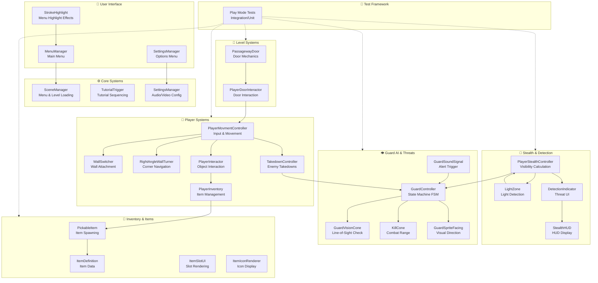

# Ink-Shinobi — Technical Documentation
**Version:** 0.2 · **Engine:** Unity 6 (LTS) · **Genre:** 2.5D Stealth Action

---

## 1. Project Overview

**Ink-Shinobi** is a 2.5D stealth game set in feudal Japan where the player controls a ninja through fully three-dimensional environments. The camera maintains a fixed side-on perspective, preserving the feel of a classic 2D platformer while exploring a living, volumetric world. Characters and enemies are 2D ink-illustrated sprites positioned in 3D space, blending hand-drawn expressiveness with genuine spatial depth.

The visual identity draws from sumi-e (ink wash painting) aesthetics: stark black-and-white palette, high-contrast silhouettes, brush-stroke UI elements, and woodblock print influences. Environments range from feudal castles and bamboo forests to moonlit temples and Shogunate city rooftops.

**Core Gameplay Pillars:**
- **Shadow Stealth** — hide in darkness, exploit blind spots, avoid guards
- **Player Traversal** — wall-climbing, wall-switching, right-angle turns, takedowns
- **Guard AI** — state-machine patrol, investigation, detection and combat
- **Inventory System** — pickable items, equipment management
- **Dynamic Detection** — real-time stealth indicator, light zones, vision cones

---

## 2. Architecture Overview



---

## 3. Technology Stack

| Domain | Technology | Status |
|---|---|---|
| Engine | Unity 6 (LTS) | ✅ Active |
| Render Pipeline | Universal Render Pipeline (URP) | ✅ Active |
| Input | Unity Input System | ✅ Active |
| Physics | 3D Rigidbody + Colliders | ✅ Active |
| Audio | Unity Audio Mixer | ✅ Active |
| Testing | Unity Test Framework (UTF) | ✅ 15+ Test Suites |
| Version Control | Git + Git LFS (GitLab) | ✅ Active |
| CI/CD | GitLab CI | ✅ Active |
| Scripting | C# (.NET Standard 2.1) | ✅ Active |

---

## 4. Player Movement & Mechanics

### 4.1 Movement Controller
`PlayerMovmentController` handles input-based character movement with three core mechanics:
- **Standard movement** — directional input with acceleration/deceleration
- **Wall attachment** — `WallSwitcher` manages adhesion to vertical surfaces
- **Corner navigation** — `RightAngleWallTurner` handles 90-degree wall transitions

### 4.2 Combat & Takedown System
`TakedownController` implements silent enemy elimination with:
- Proximity detection to guard targets
- Animation-triggered instant takedown
- Post-takedown guard state management

### 4.3 Interaction System
`PlayerInteractor` enables:
- Passageway door access via `PlayerDoorInteractor`
- Item pickup through `PickableItem` detection
- Dynamic interaction queuing

### 4.4 Inventory Management
`PlayerInventory` provides:
- Item storage and organization via `ItemSlotUI`
- Visual rendering through `ItemIconRenderer`
- Item data lookup via `ItemDefinition` ScriptableObjects

---

## 5. Stealth & Detection System

### 5.1 Stealth Calculation
`PlayerStealthController` computes real-time threat level based on:
- **Light exposure** — proximity to light sources tracked via `LightZone` components
- **Distance to guards** — inverse calculation from `GuardVisionCone` detection range
- **Movement speed** — faster movement increases visibility score

### 5.2 Detection UI
`DetectionIndicator` provides visual feedback of threat level through:
- `StealthHUD` — on-screen indicator bars and warnings
- Real-time updates from stealth calculation

### 5.3 Guard Vision System
`GuardVisionCone` implements line-of-sight detection:
- Raycasts from guard position toward player
- Considers player visibility score for probability weighting
- Visual cone gizmo for editor debugging

---

## 6. Guard AI & Enemy System

### 6.1 Guard State Machine
`GuardController` implements a hierarchical FSM with states:
- **Patrol** — default idle state, no threats detected
- **Investigating** — alert mode, moving toward last known sound location
- **TakenDown** — terminal state, guard eliminated

State transitions are triggered by:
- `InvestigateSound()` — called by sound signals or direct threat
- `PerformTakedown()` — player-initiated elimination

### 6.2 Threat Detection
Guards detect threats through:
- `GuardVisionCone` — cone-based line-of-sight check
- `GuardSoundSignal` — sound alert propagation from events
- `KillCone` — melee range threat zone
- Visual facing direction via `GuardSpriteFacing`

### 6.3 Combat Range
`KillCone` defines the proximity at which guards can attack, preventing player approach.

---

## 7. Level & Interaction Systems

### 7.1 Doors & Passageways
`PassagewayDoor` manages door state transitions:
- Locked/unlocked states
- `PlayerDoorInteractor` handles player interaction
- Blocks passage until conditions met

### 7.2 Tutorial System
`TutorialTrigger` sequences tutorial messages:
- Triggers on first scene entry
- Progressive hint system
- Disabled after tutorial completion

## 8. User Interface

### 8.1 Menus
- `MenuManager` controls main menu flow
- `SettingsManager` provides audio/video configuration
- `StrokeHighlight` applies brush-stroke visual effects to buttons

### 8.2 In-Game HUD
- `StealthHUD` displays real-time threat information
- `DetectionIndicator` provides visual threat feedback
- `ItemSlotUI` renders inventory slot information


## 9. Testing — Unity Test Framework

The project includes **test suites** covering the entire code base:

### 9.1 Play Mode Tests (Integration)
```
Assets/Tests/Guard/
├── GuardControllerTests.cs          ✅ Guard state transitions
├── GuardVisionConeTestSuite.cs      ✅ Line-of-sight detection
├── GuardSpriteFacingTestSuite.cs    ✅ Sprite direction
├── GuardSoundSignalTestSuite.cs     ✅ Alert propagation
└── KillConeTestSuite.cs             ✅ Combat range

Assets/Tests/Player/
├── PlayerTestSuit.cs                ✅ Movement integration
├── BehavioralTestSuite.cs           ✅ Player behavior
└── Stealth/
    ├── StealthTests.cs              ✅ Visibility calculation
    └── DetectionIndicatorTests.cs   ✅ UI feedback

Assets/Tests/Inventory/
└── InventoryTestSuite.cs            ✅ Item management

Assets/Tests/Passageway/
└── PassagewayTestSuite.cs           ✅ Door mechanics
```

### 9.2 Menu & UI Tests
```
Assets/Tests/Scenes/MainMenu/
├── MenuManagerTestSuite.cs          ✅ Menu flow
└── StrokeHighlightTestSuite.cs      ✅ Visual effects

Assets/Tests/Scenes/SettingsMenu/
└── SettingsManagerTestSuite.cs      ✅ Settings persistence

Assets/Tests/Player/
└── TutorialTriggerTests.cs          ✅ Tutorial sequencing
```

### 9.3 CI Integration
GitLab CI runs all tests on MR via `.gitlab-ci.yml`

---

## 10. Project Structure

```
Assets/
├── _InkShinobi/        ⚙️ Global data definitions
├── _Recovery/          ⚙️ Unity recovery files
├── Settings/           ⚙️ Unity configuration, render, input, and project settings
├── Editor/             ⚙️ Editor-only scripts, tools, and automation
│   └── CI/             ⚙️ Continuous integration scripts and build automation
├── TextMesh Pro/       📁 TextMesh Pro fonts, materials, and package resources
├── Art/                🎨 Game art
│   ├── Animations/     🎨 Entity animations as sprite sheets
│   ├── Audio/          🎨 Audio effects, such as music and SFX
│   ├── Particles/      🎨 Visual particles, such as rain
│   ├── UI/             🎨 UI art, such as buttons, fonts, etc.
│   └── VFX/            🎨 Visual effects, such as skyboxes, dynamic effects, etc.
├── Animators/          📁 Animator controllers
├── Geometry/           📁 Level geometry, colliders, tilemaps, and layout assets
├── Prefabs/            📁 Reusable prefab assets
├── Scenes/             📁 Unity scene files
├── Scripts/            💻 Runtime C# scripts
│   ├── Guard/          💻 Guard AI, patrol, detection, and behavior logic
│   ├── Inventory/      💻 Inventory, items, and pickups logic
│   ├── Passageway/     💻 Passageway behavior and interaction logic
│   ├── Player/         💻 Player input, movement, combat, and stealth logic
│   └── Scenes/         💻 Scene loading and scene-specific runtime logic
└── Tests/              🧪 PlayMode tests, mirroring the same subdivision of scripts

```

---

## 11. Key Design Decisions & Trade-offs

| Decision | Rationale | Trade-off | Mitigation |
|---|---|---|---|
| **URP over HDRP** | Broader platform target; lighter runtime cost; native 2D sprite lighting support | Fewer out-of-box lighting features; custom passes needed | Custom render feature passes for ink aesthetic |
| **2D billboard sprites for characters** | Reinforces ink-illustration aesthetic; reduces animation production cost vs full 3D rigs | Sprite sorting and shadow casting in a 3D scene require careful configuration | Sorting Layer + `Renderer.sortingOrder` with Z-depth tracking |
| **Component-based architecture** | Loose coupling; each system independently testable; easy to extend | Minimal event bus increases manual wiring complexity | Comprehensive test suite validates all integrations |
| **ScriptableObjects for all data** | Designer-friendly; no code changes to tune levels; centralized asset management | Requires asset validation to catch authoring errors | Automated validation tests in test suite |
| **Simple enum-based FSM for Guard AI** | Fast, straightforward state transitions; easy to debug | Limited to simple state flows; no hierarchical states | Proven sufficient for current gameplay requirements |
| **Hybrid 2D/3D physics** | Accurate 3D collision; simplified movement axis for 2D-style gameplay | Requires careful layer configuration to avoid unexpected interactions | Dedicated physics layer setup; well-documented in prefabs |


---

*Ink-Shinobi Technical Documentation — Last Updated 2026*